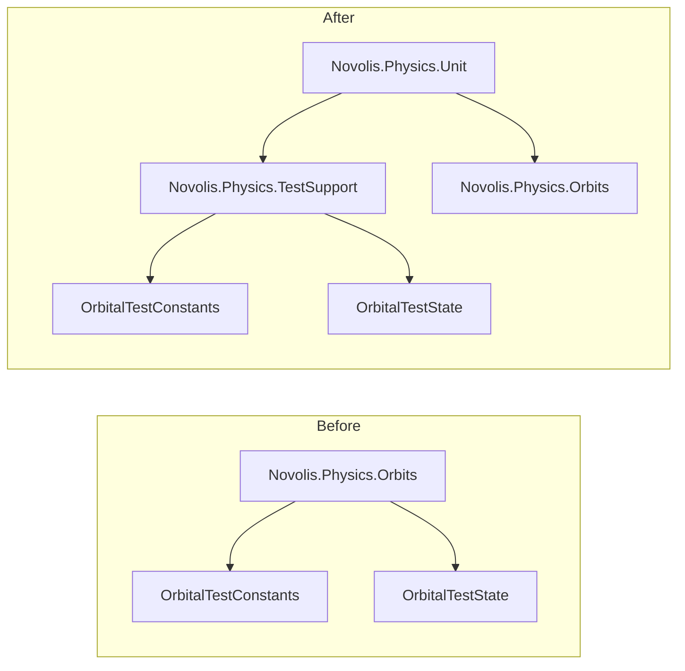

# Fix Design Review Findings

## Scope

Resolve **11 open findings** (DR-001, DR-005–DR-007, DR-009–DR-011, DR-013–DR-015) plus **P1 semver policy**. Already-resolved items (DR-002–DR-004, DR-008, DR-012) need no code changes.

**Your choices (locked in):**
- **DR-001:** Remove `IContactResolver` (ADR-4).
- **DR-005:** Move `OrbitalTestConstants` / `OrbitalTestState` out of the Orbits product package into **TestSupport**.

**Target release:** Bump shared version in [build/Novolis.Physics.Packaging.props](build/Novolis.Physics.Packaging.props) to **`0.2.0-alpha`** when applying breaking API removals.

---

## P0 — API hygiene (before stable)

### DR-001 — Remove `IContactResolver`

| Action | Detail |
|--------|--------|
| Delete | [src/Novolis.Physics.Abstractions/IContactResolver.cs](src/Novolis.Physics.Abstractions/IContactResolver.cs) |
| Docs | [README.md](README.md) — change Abstractions row from “contacts” to “force models, integrators, static-world queries” |
| Docs | [docs/INTEGRATION.md](docs/INTEGRATION.md) §3 — replace “not IContactResolver” with the **actual** contact API: `BvhStaticSphereIntegrator` + `SphereContactKinematics.ReflectWithRestitution` (link to [SphereContactKinematics.cs](src/Novolis.Physics.Collision.Simple/SphereContactKinematics.cs)) |
| Verify | `grep IContactResolver` → zero hits |

No implementations exist; only docs reference it.

### DR-005 — Move orbital fixtures to TestSupport



| Step | File / change |
|------|----------------|
| Move | `OrbitalTestConstants.cs`, `OrbitalTestState.cs` from `src/Novolis.Physics.Orbits/` → `tests/Novolis.Physics.TestSupport/` |
| Namespace | `Novolis.Physics.TestSupport.Orbits` (keeps product `Novolis.Physics.Orbits` clean) |
| References | Add to [tests/Novolis.Physics.TestSupport/Novolis.Physics.TestSupport.csproj](tests/Novolis.Physics.TestSupport/Novolis.Physics.TestSupport.csproj): `ProjectReference` to `Novolis.Physics.Orbits` + `Novolis.Physics.Numerics` |
| Tests | [tests/Novolis.Physics.Unit/EllipticalOrbitTwoBodyTests.cs](tests/Novolis.Physics.Unit/EllipticalOrbitTwoBodyTests.cs) — `using Novolis.Physics.TestSupport.Orbits;` |
| Public API | Types can stay `public` inside non-packable TestSupport (`IsPackable` is already `false`) |

Product Orbits surface after move: `OrbitState`, `LeapfrogCentralBodySoA`, `CentralOrbitSimulator`, `OrbitalMath`, `KernelMode` only.

---

## P1 — Documentation and consumer guidance

### DR-006 — Sweep limitations + example

Add **“Sweep limitations”** subsection under §3 in [docs/INTEGRATION.md](docs/INTEGRATION.md), grounded in [BvhStaticWorld.SweepSphere](src/Novolis.Physics.Collision.Simple/BvhStaticWorld.cs):

- **Algorithm:** radius-inflated ray along displacement (not continuous CCD).
- **Conservative when:** displacement per step is small vs mesh features; sphere already near surface (shallow penetration branch).
- **May miss when:** step displacement tunnels past thin walls; fast motion; capsule uses **endpoint sphere samples only** (`SweepCapsule`).
- **Mitigation:** smaller physics steps, larger sphere radius margin, or custom CCD for critical paths.

**New unit test** in [tests/Novolis.Physics.Unit/](tests/Novolis.Physics.Unit/) (e.g. `SweepLimitationScenarioTests.cs`):

- **Hit case:** extend [CollisionSweepScenarioTests](tests/Novolis.Physics.Unit/CollisionSweepScenarioTests.cs) pattern (ground triangle, partial travel) — already exists; cross-link in doc.
- **Miss / tunnel case:** thin vertical slab (two close triangles or narrow box mesh), sphere displaced **one large step** through the slab; assert `SweepSphere` returns `false` while a smaller sub-step would hit — documents non-conservative behavior without changing sweep code.

### DR-010 — Ballistics dual-path

Expand [docs/INTEGRATION.md](docs/INTEGRATION.md) §2:

| Use | API |
|-----|-----|
| Cannon / quick prototype | `ProjectileBallisticSimulation` |
| Custom forces / composition | `SimulationPipeline<ProjectileState, TEnv>` + `ProjectileSemiImplicitIntegrator` + `ProjectileQuadraticDragModel` |

State explicitly: **default gravity + quadratic drag ≡ facade** (proved by `ProjectileDragPipelineParityTests`). Add one-line cross-link in [README.md](README.md) Quick start footer.

### DR-011 — `timeSeconds` caller responsibility

- XML on [SimulationPipeline.Step](src/Novolis.Physics.Motion/SimulationPipeline.cs): pipeline does **not** advance time; caller passes `timeSeconds + dt` each step (mirror [README quick start](README.md) `time += dt` loop).
- XML on [IForceModel.Evaluate](src/Novolis.Physics.Abstractions/IForceModel.cs): `timeSeconds` is simulation time for time-varying forces; constant models may ignore it.

### Semver policy (P1 backlog item)

Add [docs/VERSIONING.md](docs/VERSIONING.md):

- `0.1.0-alpha` — breaking changes allowed.
- `0.2.0-alpha` — documents removals (`IContactResolver`, orbital fixtures from Orbits).
- Path to `1.0.0` — stable API freeze; breaking changes only in major versions.
- Link from README.

### DR-009 — TestSupport README

Rewrite [tests/Novolis.Physics.TestSupport/README.md](tests/Novolis.Physics.TestSupport/README.md):

- Title/namespace: **Novolis.Physics.TestSupport**
- Paths: `tests/Novolis.Physics.Unit/`, `dotnet run --project tests/Novolis.Physics.Unit`
- Remove StarConflictsRevolt / TestKit references (or mark as external if still relevant — prefer delete)
- Document moved `OrbitalTestConstants` / `OrbitalTestState` and [NovolisPhysicsTestTrace.cs](tests/Novolis.Physics.Unit/NovolisPhysicsTestTrace.cs)

---

## P2 — Minor API and ergonomics

### DR-007 — `timeSeconds` on force models

**Approach:** Document-only (no signature change). Shipped models (`PointMassGravityModel`, `PatchedConicGravityModel`, `SimpleLiftDragModel`, `ProjectileQuadraticDragModel`) already ignore time — add brief `<remarks>` that they are time-invariant. Defer sample time-varying `IForceModel` until a real consumer needs it.

### DR-013 — Reuse `LeapfrogCentralBodySoA` in hot paths

Extend [CentralOrbitSimulator.cs](src/Novolis.Physics.Orbits/CentralOrbitSimulator.cs):

```csharp
// New overload — no per-call SoA allocation
public static OrbitState SimulateFor(
    OrbitState initial,
    LeapfrogCentralBodySoA integrator,
    int bodyIndex,
    double durationSeconds,
    double deltaSeconds,
    KernelMode mode)
```

- Existing `SimulateFor(...)` delegates to `new LeapfrogCentralBodySoA(mu, 1)` for backward compatibility.
- XML: prefer reuse overload inside per-frame loops; `SimulateFor` convenience allocates each call.
- Optional unit smoke: two calls same `soa` instance, assert no throw.

### DR-014 — `BallisticsQueries`

No code change. One sentence in INTEGRATION §2/§3: `BallisticsQueries` is a discoverability wrapper over `IStaticWorld.SweepSphere` for projectile-sized spheres.

### DR-015 — Axis convention on Numerics

- [README.md](README.md) — short **“Conventions”** bullet: right-handed 3D, **+Y up**, gravity/ballistics use **−Y**, planar problems often XZ or XY with `Z = 0`.
- [src/Novolis.Physics.Numerics/Novolis.Physics.Numerics.csproj](src/Novolis.Physics.Numerics/Novolis.Physics.Numerics.csproj) — `<Description>` with same one-liner (shows on NuGet).

---

## Verification checklist

```bash
dotnet build Novolis.Physics.slnx
dotnet run --project tests/Novolis.Physics.Unit -c Release
```

Manual grep gates:

- `IContactResolver` — 0
- `OrbitalTestConstants` in `src/` — 0
- README / INTEGRATION / VERSIONING cover all four integration paths

Update [docs/DESIGN_REVIEW_FINDINGS.md](docs/DESIGN_REVIEW_FINDINGS.md) findings table: mark DR-001, DR-005–DR-007, DR-009–DR-011, DR-013–DR-015 resolved with brief “fixed in 0.2.0-alpha” notes (optional but keeps doc truthful).

---

## Implementation order

1. DR-005 move + TestSupport csproj/refs (unblocks clean Orbits package)
2. DR-001 delete interface + README/INTEGRATION
3. Docs batch: DR-006, DR-010, DR-011, DR-007 XML, DR-014, DR-015, VERSIONING, TestSupport README
4. DR-013 overload + DR-006 new test
5. Version bump `0.2.0-alpha` + findings doc status pass
6. Full test run

**Estimated touch count:** ~15 files, no new product packages, one new test class.
