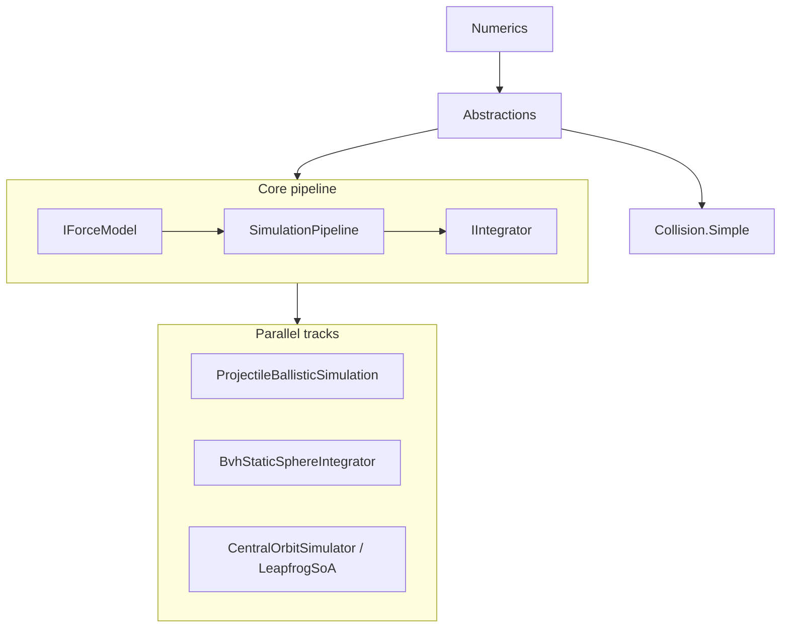
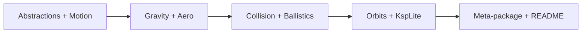

# Novolis.Physics Library Design Review Plan

## Context

[Novolis.Physics](D:/novolis/novolis-physics) is a **force-first**, modular .NET 10 physics library shipped as 10 packable projects plus a meta-package. The stated model (from [README.md](D:/novolis/novolis-physics/README.md)) is: compute forces via `IForceModel`, integrate via `IIntegrator`, orchestrate via `SimulationPipeline`.



**Scale:** ~49 `.cs` files, 20 test classes, minimal third-party deps (DI + TUnit only). A full review is feasible in **2–3 focused sessions** if scoped by package.

---

## Review objectives

| Dimension | Key question | Success signal |
|-----------|--------------|----------------|
| **API stability** | Is the public surface minimal, consistent, and evolvable? | Clear breaking-change list; no orphan contracts |
| **Architecture** | Do all domains share one mental model? | Documented integration paths; justified exceptions |
| **Consumer ergonomics** | Can a game/sim author wire this in &lt;30 min? | KspLite + README examples cover common flows |
| **Correctness** | Do tests prove invariants, not just snapshots? | Analytical/regression coverage per domain |
| **Performance** | Is allocation/GC behavior acceptable for sim loops? | Hot paths identified; no surprise allocs in `Step` |

---

## Methodology (4 phases)

### Phase 1 — Inventory and contract audit (readonly, ~2h)

1. **Export public API** per package (IDE “public members” or `dotnet build` + reflection doc).
2. **Map every public type** to one role: *contract*, *state*, *environment*, *algorithm*, *composition*, *helper*.
3. **Flag orphans** — types with no implementors or no callers outside their package.

**Known hotspots to verify first:**

| Item | Location | Review question |
|------|----------|-----------------|
| `IContactResolver<TBody>` | [IContactResolver.cs](D:/novolis/novolis-physics/src/Novolis.Physics.Abstractions/IContactResolver.cs) | Remove, implement, or document as future API? |
| Orbits vs force pipeline | [Novolis.Physics.Orbits](D:/novolis/novolis-physics/src/Novolis.Physics.Orbits/) | Intentional parallel stack or migration target? |
| Dual ballistics paths | [ProjectileBallisticSimulation.cs](D:/novolis/novolis-physics/src/Novolis.Physics.Ballistics/ProjectileBallisticSimulation.cs) vs `ProjectileQuadraticDragModel` + pipeline | When should consumers use which? |
| `BvhStaticSphereIntegrator` | [Collision.Simple](D:/novolis/novolis-physics/src/Novolis.Physics.Collision.Simple/) | Part of pipeline or standalone convenience? |
| KspLite gaps | [KspLitePhysicsServiceCollectionExtensions.cs](D:/novolis/novolis-physics/src/Novolis.Physics.KspLite/KspLitePhysicsServiceCollectionExtensions.cs) | Registers integrators/models but **not** `SimulationPipeline`, `IStaticWorld` mesh, or Orbits |

### Phase 2 — Architecture coherence (deep dive, ~3h)

Review each package against the **force-first contract**:

```csharp
// Canonical loop — SimulationPipeline.cs
total += force.Evaluate(body, environment, timeSeconds);
return _integrator.Step(body, in total, dtSeconds);
```

**Per-package checklist:**

| Package | Files to read | Coherence criteria |
|---------|---------------|-------------------|
| [Numerics](D:/novolis/novolis-physics/src/Novolis.Physics.Numerics/) | `Vector3d`, `Quaterniond`, primitives | Right-handedness, units documented, mutability rules |
| [Abstractions](D:/novolis/novolis-physics/src/Novolis.Physics.Abstractions/) | `RigidBodyState`, `ForceSample`, `HitInfo` | State vs sample separation; torque semantics |
| [Motion](D:/novolis/novolis-physics/src/Novolis.Physics.Motion/) | `SimulationPipeline`, `FixedStepAccumulator`, integrator | Time parameter propagation; substep contract |
| [Gravity](D:/novolis/novolis-physics/src/Novolis.Physics.Gravity/) | Point + patched conic | Environment immutability; `Span` usage safety |
| [Aerodynamics](D:/novolis/novolis-physics/src/Novolis.Physics.Aerodynamics/) | `IAtmosphereModel`, lift/drag | Plugs into `IForceModel`; density altitude consistency |
| [Collision.Simple](D:/novolis/novolis-physics/src/Novolis.Physics.Collision.Simple/) | `IStaticWorld`, BVH, sweeps | Documented approximation bounds (see XML on [IStaticWorld.cs](D:/novolis/novolis-physics/src/Novolis.Physics.Abstractions/IStaticWorld.cs)) |
| [Ballistics](D:/novolis/novolis-physics/src/Novolis.Physics.Ballistics/) | Projectile types, `BallisticsQueries` | Single recommended integration story |
| [Orbits](D:/novolis/novolis-physics/src/Novolis.Physics.Orbits/) | Leapfrog SoA, `OrbitalMath` | Relationship to gravity models; test-only vs product |
| [KspLite](D:/novolis/novolis-physics/src/Novolis.Physics.KspLite/) | DI extensions | End-to-end runnable preset |

**Architecture decision record (ADR) candidates** — capture yes/no with rationale:

1. **Orbits stays separate** (leapfrog SoA) vs. future `IForceModel` central-body field.
2. **Collision stays query-only** — no full rigid-body solver in v1.
3. **Ballistics** — deprecate monolithic `ProjectileBallisticSimulation` or elevate it as the primary API.
4. **`IContactResolver`** — ship in v1, delete, or move to experimental namespace.

### Phase 3 — Consumer ergonomics walkthrough (hands-on, ~2h)

Simulate three consumer personas without changing code (trace through APIs + tests):

| Persona | Goal | Walkthrough using existing tests |
|---------|------|----------------------------------|
| **Minimal** | Point mass + Euler step | `SimulationPipelineTests`, `KspLiteMinimalSimulationTests` |
| **Game room** | Gravity + collision + bounce | `BasketballEarthRoomCollisionTests`, `BouncingBallCollisionTests` |
| **Ballistics** | Drag + ground impact | `ProjectileDragPipelineParityTests`, `AnalyticalProjectileTests` |

**Ergonomics rubric (score 1–5 each):**

- Discoverability (README + package names)
- Composition (building `SimulationPipeline` manually vs KspLite)
- Type clarity (`TBody` / `TEnvironment` pairing obvious?)
- Convention docs (+Y up, −Y gravity, planar Z=0)
- Error surfaces (null mesh, zero mass, degenerate velocity)

**Doc gaps to note:**

- Root [README.md](D:/novolis/novolis-physics/README.md) has no usage example (install only).
- [TestSupport README](D:/novolis/novolis-physics/tests/Novolis.Physics.TestSupport/README.md) references legacy StarConflictsRevolt names.

### Phase 4 — Correctness and performance (test-led, ~2h)

1. **Run full suite:** `dotnet run --project tests/Novolis.Physics.Unit -c Release`
2. **Map tests → invariants** (not just scenarios):

| Test area | Invariant under review |
|-----------|------------------------|
| `ProjectileDragPipelineParityTests` | Monolithic vs pipeline drag equivalence |
| `PatchedConicGravityTests` | Sphere-of-influence switching |
| `EllipticalOrbitTwoBodyTests` | Energy/angular momentum drift |
| `CollisionSweepScenarioTests` | Sweep conservative vs false negatives |
| `FixedStepAccumulatorTests` | Determinism across variable frame times |

3. **Performance spot-check** (optional but recommended): inspect `Step` hot paths for allocations (`new`, LINQ, boxing); `LeapfrogCentralBodySoA` and BVH query paths are primary candidates.

---

## Findings template (deliverable)

Produce a single **Design Review Findings** doc (markdown or issue) with:

```text
ID | Severity (Blocker/Major/Minor/Nit) | Area | Finding | Recommendation | Effort
```

**Severity guide:**

- **Blocker** — Wrong physics, API that misleads consumers, breaking without semver plan
- **Major** — Architectural fork (dual paths), orphan public API, missing docs for approximations
- **Minor** — Naming, DI gaps, test harness friction
- **Nit** — Style, comment drift

**Pre-seeded findings to validate (not assume):**

1. `IContactResolver` is public with zero implementations — API surface leak.
2. Three integration styles coexist (pipeline, `ProjectileBallisticSimulation`, `BvhStaticSphereIntegrator`, Orbits leapfrog).
3. KspLite does not register `SimulationPipeline` or wire force models into a runnable simulation.
4. `IStaticWorld` sweeps are documented as approximate — consumers need worked examples of failure modes.
5. Meta-package [Novolis.Physics](D:/novolis/novolis-physics/src/Novolis.Physics/) includes Orbits but KspLite does not reference it.

---

## Recommended review order (efficiency)



Start at **Abstractions + Motion** — every other package is judged against `IForceModel` / `SimulationPipeline`. End with **packaging and consumer docs**.

---

## Post-review actions (prioritized backlog)

After findings are triaged:

1. **API hygiene** — Remove or implement `IContactResolver`; mark experimental APIs if keeping.
2. **Unify integration stories** — One recommended ballistics path; document Orbits boundary.
3. **KspLite v0.2** — Add `AddSimulationPipeline()` (or sample extension) registering forces + world + fixed step.
4. **Consumer docs** — Minimal README example: gravity + pipeline + one collision test scenario distilled.
5. **Semver policy** — Document what 0.1.0-alpha guarantees before stable.

---

## Suggested participants and timebox

| Role | Responsibility |
|------|----------------|
| **Library owner** | ADR decisions, API breaks |
| **Consumer rep** (game/sim) | Phase 3 walkthrough |
| **Reviewer** | Phase 1–2 contract + architecture |
| **QA / tests** | Phase 4 invariant mapping |

**Total timebox:** 8–10 hours spread across 2–3 sessions; can parallelize Phase 1 inventory and Phase 4 test run.

---

## What this plan does not include

- Implementing fixes (separate implementation PRs per finding).
- Benchmark suite creation (only spot-check unless Blocker found).
- Security audit (no network/I/O in library scope).
