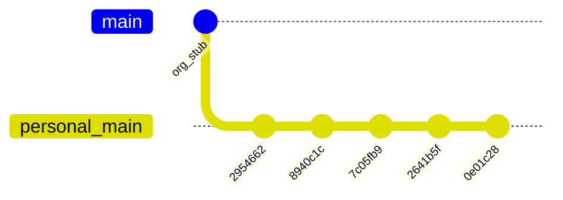

# Migrate novolis-physics history to Novolis-Platform

## Current state



| Location | `main` tip | Notes |
|----------|------------|--------|
| Local [`d:\novolis\novolis-physics`](d:\novolis\novolis-physics) | `0e01c28` | Clean tree; **5** implementation commits |
| `origin` → `frankhaugen/novolis-physics` | `0e01c28` | Wrong remote (mirror of local) |
| [`Novolis-Platform/novolis-physics`](https://github.com/Novolis-Platform/novolis-physics) | `a84d69b4` | **Keep this** — `Bootstrap Novolis organization infrastructure` (21 skeleton files: governance, issue templates, stub workflows, placeholder docs) |

**Local commit sequence** (oldest → newest):

1. `2954662` — Initial Novolis.Physics stack (numerics, motion, gravity, ballistics, collision, orbits, KspLite, 46 tests)
2. `8940c1c` — Remove leftover StarConflictsRevolt test support project file
3. `7c05fb9` — Remove KspLite package; integration guide and examples
4. `2641b5f` — README/docs refactor; `0.2.0-alpha`; remove orphan `IContactResolver`
5. `0e01c28` — Enhanced docs, examples, XML doc generation

**Target history** (new SHAs OK; messages and tree content preserved):

```text
a84d69b4  Bootstrap Novolis organization infrastructure   ← org root (unchanged)
    →     Initial Novolis.Physics stack…
    →     Remove leftover StarConflictsRevolt…
    →     Remove KspLite package…
    →     Refactor README and documentation…
    →     Enhance documentation across multiple files…
```

**Method:** `git rebase --onto novolis/main --root main` — same approach as [novolis-raylib migration](d:\novolis\novolis-raylib\.cursor\plans\migrate_to_org_remote_8bc5fb98.plan.md). No unrelated-history merge, no force-push of alien root.

**Pre-flight:** Confirm `git status` is clean on `main` before starting (stash or commit any WIP).

---

## Phase 1 — Safety backup

```powershell
cd d:\novolis\novolis-physics
git branch backup-pre-org-migrate
git bundle create ..\novolis-physics-backup.bundle --all
```

---

## Phase 2 — Add org remote and rebase

```powershell
git remote add novolis https://github.com/Novolis-Platform/novolis-physics.git
git fetch novolis
git log --oneline -1 novolis/main   # expect: a84d69b4 Bootstrap Novolis organization infrastructure
git checkout main
git rebase --onto novolis/main --root main
```

**Expected conflicts** on the first replay (`2954662` vs org skeleton overlap). Same resolution pattern as raylib:

| Path | Resolution |
|------|------------|
| [`README.md`](README.md) | Keep **implementation** README (install, quick start, docs links) |
| [`.github/workflows/ci.yml`](.github/workflows/ci.yml) | Keep **local** (builds `Novolis.Physics.slnx`, runs unit tests, pack-smoke) |
| [`.github/workflows/release.yml`](.github/workflows/release.yml) | Keep **org** file (local tree has no release workflow) |
| [`Directory.Build.props`](Directory.Build.props), [`Directory.Packages.props`](Directory.Packages.props) | Keep **local** (real solution); merge any org-only keys if missing |
| [`global.json`](global.json) | Keep **org** (local has none) |
| [`.novolis/packages.json`](.novolis/packages.json) | Keep **org** (local has no `.novolis/`) |
| [`NuGet.config`](NuGet.config) vs [`nuget.config`](nuget.config) | Use org filename **`NuGet.config`**; merge local feed/settings into it (avoid duplicate case-only paths — Linux CI is case-sensitive) |
| `CODE_OF_CONDUCT.md`, `CONTRIBUTING.md`, `SECURITY.md`, `SUPPORT.md`, `LICENSE`, issue/PR templates | Keep **org** unless a later replay explicitly replaces them |
| Org-only docs (`docs/design.md`, `docs/getting-started.md`, `docs/release.md`) | Keep **org** stubs alongside local `docs/` tree (no conflict if paths differ) |

After each conflict: `git add .` → `git rebase --continue`. To abort: `git rebase --abort`, then `git reset --hard backup-pre-org-migrate`.

---

## Phase 3 — Push to org and repoint `origin`

```powershell
# Should fast-forward org main from a84d69b4 → new tip
git push novolis main:main

git remote set-url origin https://github.com/Novolis-Platform/novolis-physics.git
git fetch origin
git branch -u origin/main main
git remote remove novolis   # or rename to novolis-temp
git remote add fork https://github.com/frankhaugen/novolis-physics.git   # optional archive pointer
```

**Verification:**

```powershell
git log --oneline origin/main          # 6 commits: org stub + 5 replayed
git diff backup-pre-org-migrate main   # expect empty (same tree, different base/history)
dotnet build Novolis.Physics.slnx -c Release
dotnet run --project tests/Novolis.Physics.Unit -c Release --no-build
```

On GitHub:

- [`Novolis-Platform/novolis-physics`](https://github.com/Novolis-Platform/novolis-physics) shows full codebase on `main`
- Actions: CI green on org repo ([`.github/workflows/ci.yml`](.github/workflows/ci.yml))
- If/when NuGet publish is enabled: org [`release.yml`](https://github.com/Novolis-Platform/novolis-physics/blob/main/.github/workflows/release.yml) on `main` must match trusted publisher config

If `git push novolis main:main` is rejected (branch protection): push branch `migrate-main` and open PR; do **not** use unrelated-history merge.

---

## Phase 4 — Fix stale `frankhaugen` URLs (post-rebase commit)

Rebase preserves file content; these still point at the personal fork and should be updated **after** push (one small commit on org `main`):

| File | Change |
|------|--------|
| [`build/Novolis.Physics.Packaging.props`](build/Novolis.Physics.Packaging.props) | `PackageProjectUrl` / `RepositoryUrl` → `https://github.com/Novolis-Platform/novolis-physics` |
| [`src/Novolis.Physics/README.md`](src/Novolis.Physics/README.md) | Doc links → `Novolis-Platform/novolis-physics` paths |

Optional: re-run `git diff backup-pre-org-migrate main` after URL commit — should differ only on those URL lines (or accept URL diff as intentional improvement).

---

## Phase 5 — Retire mistaken personal repo

After org `main` is verified (files, CI, log order):

1. Archive **`frankhaugen/novolis-physics`** on GitHub (Settings → Archive)
2. Re-sync Rider VCS root: [`.idea/.idea.Novolis.Physics/.idea/workspace.xml`](.idea/.idea.Novolis.Physics/.idea/workspace.xml) still references `https://github.com/frankhaugen/novolis-physics.git`

---

## Phase 6 — Prevent recurrence (mirror novolis-raylib)

Add the same guardrails already used in raylib:

1. **[`AGENTS.md`](AGENTS.md)** — new file with a **Git remote (Novolis-Platform)** section (copy pattern from [`d:\novolis\novolis-raylib\AGENTS.md`](d:\novolis\novolis-raylib\AGENTS.md) lines 172–182; point at `Novolis-Platform/novolis-physics`)
2. **[`.cursor/rules/novolis-git-remote.mdc`](.cursor/rules/novolis-git-remote.mdc)** — copy from [`d:\novolis\novolis-raylib\.cursor\rules\novolis-git-remote.mdc`](d:\novolis\novolis-raylib\.cursor\rules\novolis-git-remote.mdc) (repo-agnostic rule for all `d:\novolis\*`)

Commit guard files on org `main` after migration.

---

## Rollback

**Before push:**

```powershell
git checkout main
git reset --hard backup-pre-org-migrate
```

**After bad push:** org admin resets `main` to `a84d69b4` via GitHub UI; restore from `backup-pre-org-migrate` or `..\novolis-physics-backup.bundle`.

---

## Comparison to novolis-raylib

| | raylib | physics |
|---|--------|---------|
| Implementation commits | 7 | **5** |
| Org stub SHA | `3e68ba07` | **`a84d69b4`** |
| Local `release.yml` | Yes (keep local) | **No** (keep org stub) |
| `global.json` | Both | **Org only** — take org |
| Extra post-migrate fix | IDE workspace | **NuGet metadata URLs** + IDE workspace |
