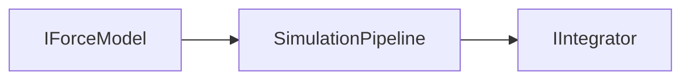

# Architecture

Novolis.Physics is modular: small NuGet packages with a shared **force-first** loop for game-style simulation, plus specialized stacks where a monolithic pipeline is a poor fit.

## Canonical pipeline



```csharp
// One fixed step: sum forces, then integrate.
total += force.Evaluate(body, environment, timeSeconds);
body = integrator.Step(body, in total, dtSeconds);
```

**Caller responsibilities:**

- Advance **simulation time** yourself (`timeSeconds + dt` each step).
- Own **environment** values (`PointMassField`, meshes, atmosphere data).
- Use **`FixedStepAccumulator`** to turn variable frame time into fixed physics steps.

## Package dependency graph

```
Numerics
  └── Abstractions
        ├── Motion, Gravity, Aerodynamics, Collision.Simple
        ├── Ballistics (+ Collision.Simple)
        └── Orbits (Numerics only)
              Novolis.Physics (meta) → all product packages
```

| Package | Responsibility |
|---------|----------------|
| **Numerics** | `Vector3d`, `Quaterniond`, rays, primitives |
| **Abstractions** | `IForceModel`, `IIntegrator`, `IStaticWorld`, state samples |
| **Motion** | `SimulationPipeline`, rigid-body integrator, fixed-step helper |
| **Gravity** | Point-mass and patched-conic `IForceModel` |
| **Aerodynamics** | Atmosphere density + simple lift/drag |
| **Collision.Simple** | Static mesh BVH queries; sphere sweep integrator |
| **Ballistics** | Projectile state, drag, queries, optional facade |
| **Orbits** | Central-body leapfrog (parallel stack, not `SimulationPipeline`) |

## Four integration styles

Not every feature uses the pipeline. Pick the style that matches the problem:

| Style | When | Entry types |
|-------|------|-------------|
| **Pipeline** | Arbitrary forces on rigid bodies or projectiles | `SimulationPipeline`, `IForceModel`, `IIntegrator` |
| **Ballistics facade** | Quick cannon with −Y gravity + optional drag | `ProjectileBallisticSimulation` |
| **Collision integrator** | Sphere in a static mesh with contact | `BvhStaticSphereIntegrator`, `IStaticWorld` |
| **Orbits** | Long two-body tests, SoA leapfrog | `CentralOrbitSimulator`, `LeapfrogCentralBodySoA` |

See [INTEGRATION.md](INTEGRATION.md) for decision tables and limitations (especially mesh sweeps).

## Coordinates and units

- Right-handed 3D; **+Y is up**.
- Gravity and ballistics use **−Y** for uniform gravity.
- SI-style units unless noted: meters, seconds, kilograms, newtons.
- `PointMassField` stores **GM** (m³/s²), not separate mass and G.

## Related documents

- [INTEGRATION.md](INTEGRATION.md) — consumer walkthroughs
- [examples/](examples/) — copy-paste recipes
- [VERSIONING.md](VERSIONING.md) — API stability
